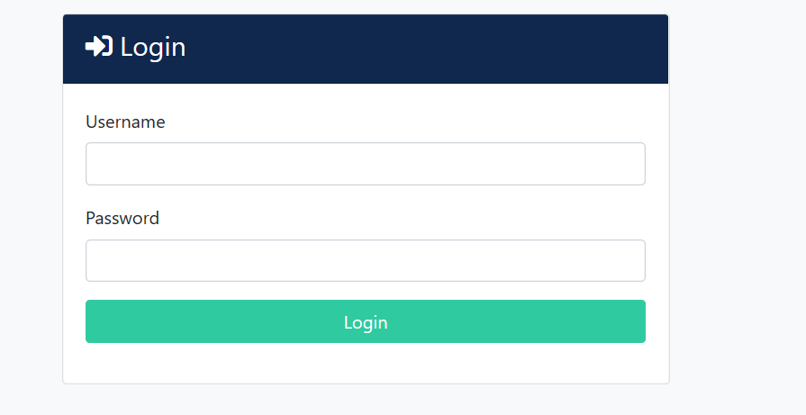
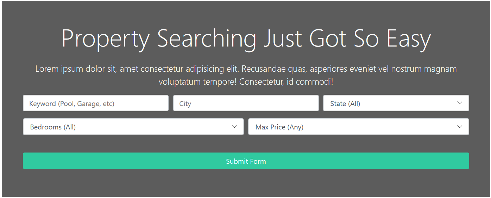
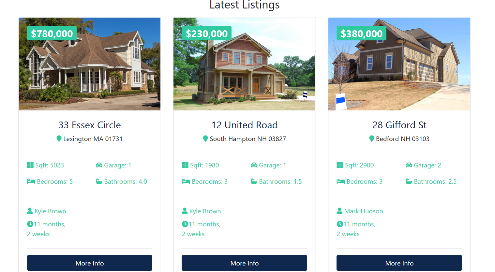
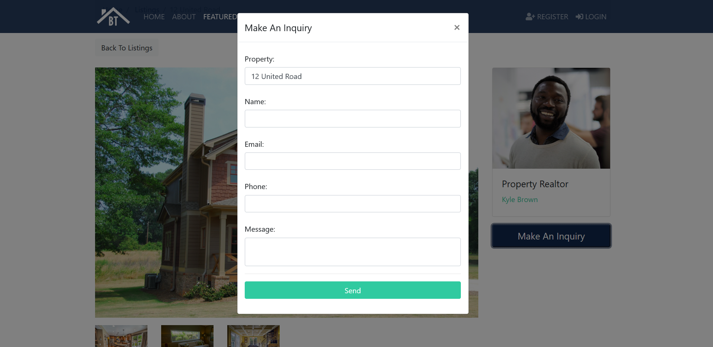
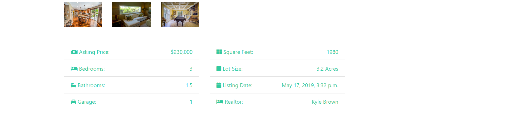

# Django Project
A Django project on house selling website. 
 
# Features
(i) Login Module for buyer and seller separately.  
(ii) Buyer can also search by the Sq.feet, number of bed room, garages etc.
 

# Login Module

 

# Search Bar:

 

# Latest Listings of Houses

 

# Make an Inquiry for particular House

 

# Feature of Houses

 

# Steps of run the Application

(Environment is given in the project you just have to activate it)

Step 1: Download the project and open in the editor.

Step 2: Type the command in the terminal "python manage.py runserver".

Step 3: Click on the url given in the terminal or else open the same port number in your web browser.
